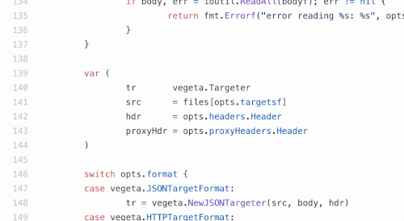

<h1 align="center">
   
  
   
  CodeWyng
   
</h1>

<h4 align="center">Chrome extension for browsing GitHub like an IDE</h4>

  
  
  

  <a href="https://codewyng.io">CodeWyng.io</a> •
  <a href="https://chrome.google.com/webstore/detail/njkkfaliiinmkcckepjdmgbmjljfdeee"> Chrome Web Store</a> •
  <a href="https://github.com/CodeWyng/codewyng">Issues</a> •
  <a href="https://twitter.com/CodeWyng">@CodeWyng</a> •
  <a href="mailto:mail@codewyng.io">mail@codewyng.io</a>
   
   
  

# Features

**Hover documentation:** hovering over a variable shows its docstring.

 
 
 
 
 
 
 
 

**Jump-to-definition:** clicking on a variable takes you to its definition (works across files, too!).

 
 
 
 
 
 
 

**Find-references:** clicking on a definition opens a list of references.

 
 
 
 
 
 
 
 

**Quick search:** <kbd>Cmd+/</kbd> or <kbd>Alt+/</kbd> opens an exact punctuation-aware search box.

 
 
 
 
 
 
 

Install CodeWyng from the <a href="https://chrome.google.com/webstore/detail/njkkfaliiinmkcckepjdmgbmjljfdeee"> Chrome Web Store</a>!

# Development

1. Install Node.js and `npm install -g yarn`
2. Run `./dev`
3. Open chrome://extensions/
4. Turn on **Developer mode**
5. Click **Load unpacked**
6. Select the `dist-dev` directory created by `./dev` above
7. Try hovering on variables in https://github.com/gorilla/mux/blob/master/mux.go
