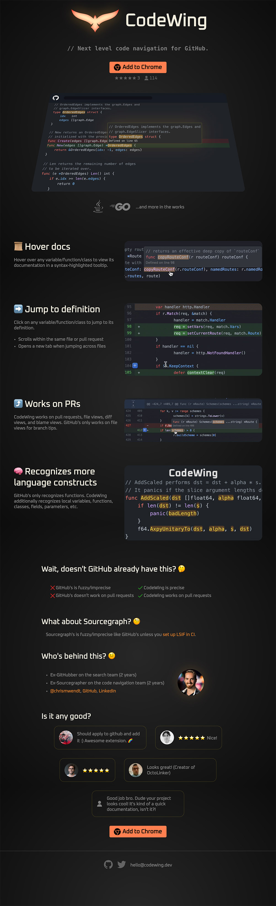

<h1 align="center">Next level code navigation for GitHub</h1>

  <a href="https://codewing.dev">codewing.dev</a>
  •
  
  
  
  •
  

- 📜 Hover over a variable to view its documentation
- ➡️ Click on a variable to jump to its definition
- 🧠 Understands all language constructs (local variables, functions, etc.)
- ⤴️ Works on pull requests
- ⚡️ Lightning fast
- 📝 Works on Java and Go code (more languages coming)

<h1 align="center">
   
  
</h1>
